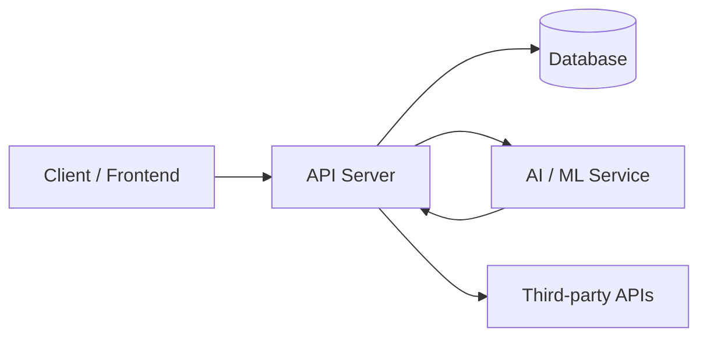

# [Project Name]

### **DSOLVE 2026** · DRISHTI · College of Engineering Trivandrum (CET)

**BUILD. SOLVE. DEMONSTRATE.**

|                   |                                           |
| ----------------- | ----------------------------------------- |
| **Problem:**      | Problem N — [Problem Title]               |
| **Team Name:**    | [Your Team Name]                          |
| **Team Members:** | [Name 1] · [Name 2] · [Name 3] · [Name 4] |
| **Institution:**  | [College / University]                    |
| **State:**        | 🟢 In Development / ✅ Submitted          |
| **Live Demo:**    | [Demo link goes here]                     |
| **Pitch Video:**  | [Social media pitch video link]           |
| **Repo:**         | [Public GitHub URL]                       |

---

## Table of Contents

1. [Problem Statement](#1-problem-statement)
2. [Our Solution](#2-our-solution)
3. [Key Features](#3-key-features)
4. [Screenshots & Demo](#4-screenshots--demo)
5. [Tech Stack](#5-tech-stack)
6. [Architecture](#6-architecture)
7. [Folder Structure](#7-folder-structure)
8. [Getting Started](#8-getting-started)
9. [Usage / Demo Script](#9-usage--demo-script)
10. [Testing](#10-testing)
11. [Limitations & Future Scope](#11-limitations--future-scope)
12. [Team](#12-team)
13. [Submission Checklist](#13-submission-checklist)

---

> **🙋 READ THIS FIRST:** This is a fork of the official DSOLVE 2026 solution template.
> Replace every placeholder beginning with `[` with your own content, then delete
> this note and the placeholders in [Section 13](#13-submission-checklist) as you complete them.

---

## 1. Problem Statement

> _Copy the official problem statement you chose (from `docs/problem-statements.md`)._
>
> ## Problem N: [Title]
>
> [Paste the full official problem text here]

### Why this matters

[Short paragraph: the real-world impact, who is affected, cost of the status quo.]

---

## 2. Our Solution

[Describe in 3–5 bullets what you built, how it solves the problem, and what makes it
different from existing approaches.]

- **[Differentiator 1]** — [one-line explanation]
- **[Differentiator 2]** — [one-line explanation]
- **[Differentiator 3]** — [one-line explanation]

### Target Users

| User                         | Pain Point | What We Give Them |
| ---------------------------- | ---------- | ----------------- |
| [e.g. Dental practice owner] | [pain]     | [solution]        |
| [e.g. Patient]               | [pain]     | [solution]        |
| [e.g. Clinical team]         | [pain]     | [solution]        |

---

## 3. Key Features

- **🎯 Feature 1** — [what it does]
- **⚡ Feature 2** — [what it does]
- **🛠 Feature 3** — [what it does]
- **📊 Feature 4** — [what it does]

_Timeline of build:_ Built end-to-end during the 36-hour DSOLVE 2026 window
(17th Sept, 6:00 PM → 19th Sept, 6:00 AM).

---

## 4. Screenshots & Demo

<!-- Add screenshots under /assets/screenshots and demo GIFs under /assets/demo -->

| Screenshot                                            | Description                          |
| ----------------------------------------------------- | ------------------------------------ |
| [Screenshot 1](./assets/screenshots/screenshot-1.png) | [What it shows]                      |
| [Screenshot 2](./assets/screenshots/screenshot-2.png) | [What it shows]                      |
| [Pitch Video](./assets/pitch/README.md)               | Link to your >30s social pitch video |

---

## 5. Tech Stack

| Layer           | Technology                         | Why we chose it |
| --------------- | ---------------------------------- | --------------- |
| Frontend        | [your frontend framework/platform] | [reason]        |
| Backend         | [your backend framework/platform]  | [reason]        |
| Database        | [your database]                    | [reason]        |
| ML / AI         | [your AI/ML tools/models]          | [reason]        |
| Infra / Hosting | [where your solution runs]         | [reason]        |

> Fill values in the column **"Technology"** only — no language or framework is
> prescribed; your team chose what fits the problem best.

_All libraries and AI models/frameworks used are open-source or publicly available,
as permitted by the DSOLVE 2026 rules._

---

## 6. Architecture

<!-- Replace with your own diagram (Mermaid or image in /assets/architecture.png) -->



[Paragraph on how the pieces interact, where the intelligence lives, and how data flows.]

---

## 7. Folder Structure

```
.
├── backend/            # Server, API, microservices, ML services
│   └── README.md
├── frontend/           # Web / mobile application
│   └── README.md
├── docs/               # Architecture, pitch deck outline, problem statements
│   ├── architecture.md
│   ├── pitch-deck-outline.md
│   └── problem-statements.md
├── assets/             # Screenshots, demo recordings, pitch video
│   ├── screenshots/
│   ├── demo/
│   └── pitch/
├── AGENTS.md           # AI-assistant instructions (optional)
├── SUBMISSION_CHECKLIST.md
└── README.md
```

---

## 8. Getting Started

### Prerequisites

- Your chosen runtime(s) and tools — list them here with versions: `[e.g. runtime X ≥ version]`
- [Any accounts / API keys required]

### Installation

```bash
# 1. Clone the repository
git clone https://github.com/<your-org>/<your-repo>.git
cd <your-repo>

# 2. Backend — replace the <commands> below with the ones for YOUR stack
#    (see backend/README.md for your team's exact commands)
cd backend
<install backend dependencies your package manager uses>
<copy and edit your environment file, e.g. .env.example -> .env>
<start the backend server>
```

```bash
# 3. Frontend — replace the <commands> below with the ones for YOUR stack
#    (see frontend/README.md for your team's exact commands)
cd frontend
<install frontend dependencies with your package manager>
<start the frontend app>
```

### Environment Variables

| Variable       | Description                       | Example                           |
| -------------- | --------------------------------- | --------------------------------- |
| `API_KEY`      | API key for a third-party service | `sk-xxxxxxxxxxxxxxxxxx`           |
| `DATABASE_URL` | Database connection string        | `your-database-connection-string` |
| `PORT`         | Port the backend listens on       | `8000`                            |

> ⚠️ Values above are illustrative examples — replace them with your own. Never
> commit real keys: use a `.env` file (already gitignored) or `.env.example`.

---

## 9. Usage / Demo Script

_This doubles as your live demo runbook (3–5 min)._

1. **Boot** — start backend + frontend.
2. **Walkthrough step 1** — [what the judge sees].
3. **Walkthrough step 2** — [what the judge sees].
4. **Highlight** — [the "wow" moment / core differentiator].
5. **Wrap-up** — [summary + where this goes in production].

---

## 10. Testing

```bash
# Replace <command> with the test/lint command for YOUR stack
# Backend
cd backend && <your test command>

# Frontend
cd frontend && <your test command> && <your lint command>
```

[Describe what test coverage exists and how to run linters/type checks.]

---

## 11. Limitations & Future Scope

### Known Limitations

- [Limitation 1]
- [Limitation 2]

### Future Scope

- [Planned improvement 1]
- [Planned improvement 2]

---

## 12. Team

| Name     | Role(s)                         | GitHub    | Email   |
| -------- | ------------------------------- | --------- | ------- |
| [Name 1] | [e.g. Full-stack / ML / Design] | [@handle] | [email] |
| [Name 2] |                                 |           |         |

---

## 13. Submission Checklist

**Before 6:00 AM (Code Freeze) – Sat, Sept 19th:**

- [ ] Clean, runnable source code committed to this **public** repo
- [ ] `README.md` fully filled in (all sections above)
- [ ] Pitch video (>30s, English) posted on team member's social profile
      tagging **@DrishtiCET** & **@CareStack** and link added above
- [ ] All secrets/API keys removed from the repo
- [ ] Quick-start verified from a fresh clone (`git clone` → run)

---

**[Problem Statements](./docs/problem-statements.md)** ·
**[Submission Checklist](./SUBMISSION_CHECKLIST.md)** ·
**DSOLVE 2026 Guidelines**
