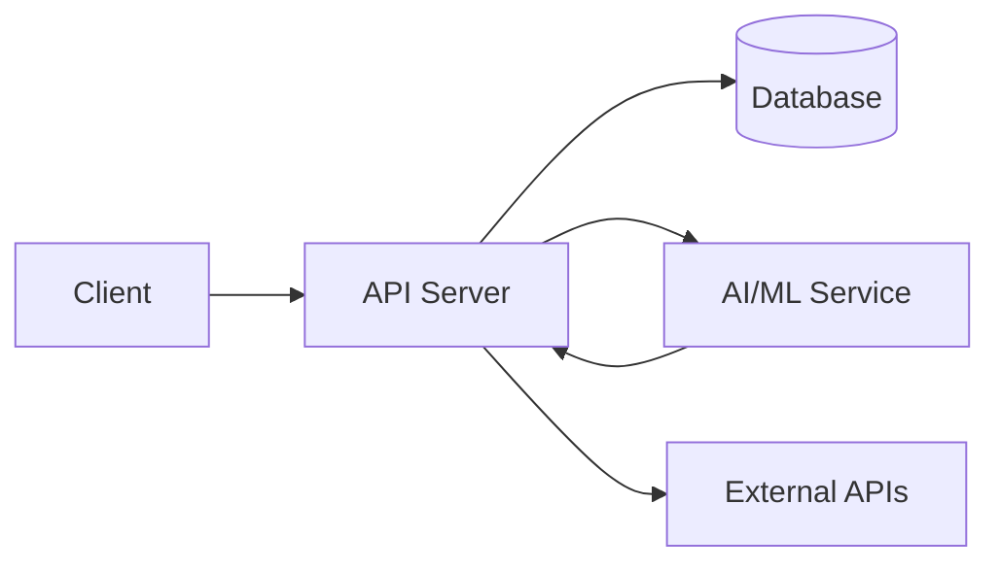

# Architecture — [Project Name]

> Fill this in as you build. Judges will ask about these decisions in the
> technical Q&A. Keep it honest — "we tried X, it failed, so we used Y" scores
> better than vague hand-waving.

## Overview

[2–3 sentence summary of the system and what it does.]

## System Diagram

<!-- Replace with Mermaid, draw.io, or an image in ../assets/architecture.png -->

## Components

### Frontend (`frontend/`)

- Framework/library: [your choice]
- Key flows: [login, upload, dashboard, ...]
- State management: [your choice]

### Backend (`backend/`)

- Framework: [your choice]
- Endpoints: [list key API routes]
- Background jobs (if any): [cron, queues, webhooks]

### Data

- Database: [type + reasons]
- Schema highlights: [tables/models, relations]
- Storage: [where images/files live]

### AI / ML (if applicable)

- Model(s): [names and source — must be open-source or public]
- Pipeline: [preprocessing → inference → postprocessing]
- Latency / accuracy notes: [numbers you measured]

### Integrations

- [Third-party APIs, camera SDKs, email/SMS providers, insurance eligibility
  services, etc.] — and why each was chosen.

## Key Decisions & Trade-offs

| Decision | Alternatives considered | Why we chose this |
|----------|-------------------------|-------------------|
| [e.g. your database choice] | [option A, option B] | [reason] |
| [e.g. on-device vs cloud processing] | [option A, option B] | [cost/privacy/latency] |

## Resiliency & Security

- [Auth approach, data anonymisation, HTTPS, rate limiting, error handling.]

## Deployment

- [Where/how your solution runs — with the exact commands used.]

## What We'd Do With More Time

- [Scaling, model fine-tuning, auth hardening, more integrations...]